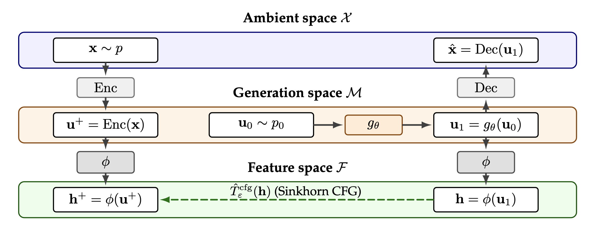

# Generate in Reconstruction Space, Match in Semantic Space: Transport Geometry for One-Step Generation (official implementation)

[[Paper]](https://arxiv.org/abs/2606.00514) [[Checkpoints]](https://huggingface.co/huguesva/semantic-transport-generation)

We introduce an architecture for one-step image generation where a generator maps noise to an image in a single forward pass inside a pretrained autoencoder's latent space. On top of this latent space, we train a frozen self-supervised featurizer that provides semantic features. The distributional matching loss used to train the generator is defined in this semantic feature space. At inference, only the generator and decoder are needed (one forward pass, no featurizer, no iterative sampling).

<p align="center">
  
</p>

Semantic features discard nuisance reconstruction variation, making the distribution matching problem lower-dimensional and statistically more tractable. The optimal transport couplings estimated from finite minibatches become more stable, directly improving the training signal. This gives a **39x FID reduction** on class-conditional ImageNet (134 to 3.46).

The training loss is a Sinkhorn divergence with classifier-free guidance:

$$\mathcal{L} = (1+w) S_\varepsilon(q_\theta, r_c) - w S_\varepsilon(q_\theta, r)$$

where $S_\varepsilon$ is the [Sinkhorn divergence](https://arxiv.org/abs/1810.08278), $q_\theta$ is the generated feature distribution, $r_c$ is the real feature distribution for class $c$, $r$ is the unconditional real feature distribution, and $w$ is a per-class guidance weight.

<p align="center">
  
</p>

<p align="center">
  <em>Uncurated ImageNet 256x256 samples (one step, no refinement). Each row uses a different frozen SSL featurizer during training. The featurizer is not used at inference.</em>
</p>

## Installation

```bash
git clone https://github.com/huguesva/semantic-transport-generation.git
cd semantic-transport-generation
pip install -e . -r requirements.txt
```

## Data Preparation

Training operates on precomputed SD-VAE latents. Encode ImageNet 256x256 images into sharded `.pt` files:

```bash
python scripts/precompute_latents.py \
    --imagenet_dir /path/to/imagenet \
    --output_dir /path/to/imagenet256_latents \
    --vae stabilityai/sd-vae-ft-mse
```

Then set `data_dir` in `experiments/dataset/imagenet256_latent.yaml` to point to the output directory.

## Training

Experiments can be launched via the `spt` CLI provided by [stable-pretraining](https://github.com/rbalestr-lab/stable-pretraining).

```bash
spt run experiments/main.yaml                         # MAE mask 50% featurizer (default, best)
spt run experiments/main.yaml featurizer=mae_60       # MAE mask 60%
spt run experiments/main.yaml featurizer=mae_75       # MAE mask 75%
spt run experiments/main.yaml featurizer=dinov3       # DINOv3 distillation
spt run experiments/main.yaml featurizer=inception    # Inception distillation
```

See the paper for data preparation details and full experimental setup.

## Pretrained Checkpoints

Generators and featurizers are available at [huguesva/semantic-transport-generation](https://huggingface.co/huguesva/semantic-transport-generation) on Hugging Face.

## Citation

```bibtex
@misc{vanassel2026generatereconstructionspacematch,
      title={Generate in Reconstruction Space, Match in Semantic Space: Transport Geometry for One-Step Generation}, 
      author={Hugues Van Assel and Edward De Brouwer and Saeed Saremi and Gabriele Scalia and Aviv Regev},
      year={2026},
      eprint={2606.00514},
      archivePrefix={arXiv},
      primaryClass={cs.LG},
      url={https://arxiv.org/abs/2606.00514}, 
}
```
